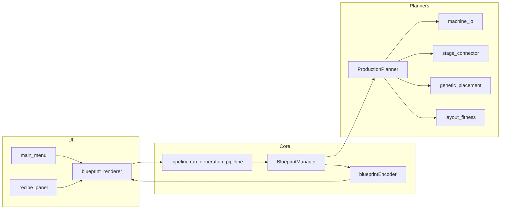

# Architecture

## High-level flow



## Repository layout

```
FactorioGenerator/
├── main.py              # Entry: sys.path setup, config, menus, recipes load
├── config.json          # User-local (gitignored): Factorio install path
├── docs/                # This documentation
├── tests/               # unittest (calculations today)
└── src/
    ├── core/            # Grid, pipeline, encoding, routing utilities
    ├── planners/        # Production planning, placement, connection
    ├── ui/              # Pygame screens (flat imports from ui/)
    └── data/            # recipes.json, buildngs.json
```

## Import conventions (important)

`main.py` inserts both `src/` and `src/ui/` at the front of `sys.path`:

```python
# main.py
from src.ui.blueprint_renderer import BlueprintRenderer   # package style

# Inside src/planners/production_planner.py
from core.constants import GenerationMode                  # flat style
from planners.stage_connector import connect_stages
```

| Location | Typical import style |
|----------|-------------------|
| `main.py` | `from src.core...`, `from src.ui...` |
| `src/core/*`, `src/planners/*` | `from core...`, `from planners...` |
| `src/ui/*` | `from core...`, `from toolbar import Toolbar` (ui on path) |

When adding modules, match the folder you are in. Running tests uses `sys.path.insert(0, "src")` — see `tests/test_calculations.py`.

## Active pipeline (use this)

| Step | Module | Responsibility |
|------|--------|----------------|
| 1 | `ui/blueprint_renderer.py` | Workspace, camera, calls pipeline on Generate |
| 2 | `core/pipeline.py` | `run_generation_pipeline()` — grid, manager, encode, `BlueprintGenerationResult` |
| 3 | `core/blueprint_manager.py` | Instantiates `ProductionPlanner`, picks rule vs genetic |
| 4 | `planners/production_planner.py` | Rate graph, machine placement, stage connection, summaries |
| 5 | `planners/machine_io.py` | Per-machine belt + inserter block (east flow) |
| 6 | `planners/stage_connector.py` | Manhattan belt paths between stages + base-material bus |
| 7 | `planners/genetic_placement.py` | Optional GA positions (when `PlacementStrategy.GENETIC`) |
| 8 | `planners/layout_fitness.py` | Scores layouts (viability + efficiency); drives rule-based row pick |
| 9 | `core/blueprintEncoder.py` | Blueprint JSON → export string |

### Shared runtime objects

Each generation creates a fresh:

- **`Grid`** (`grid_env.py`) — `occupied` dict keyed by `(x, y)` tile; `is_occupied(x, y, w, h)` for rectangles.
- **`Pathfinder`** — A* over free tiles (used by `BeltRouter`, not by `stage_connector`).
- **`BeltRouter`** — Places belts along A* paths; **not** used for inter-stage links today.

`ProductionPlanner` receives all three but stage linking is implemented in `stage_connector` with L-shaped Manhattan paths.

## Legacy / inactive code (do not extend by default)

| Path | Status |
|------|--------|
| `planners/machine_placer/` | Older placement APIs (`ProductionLinePlacement`, recursive lines). **Not** called from `BlueprintManager`. |
| `core/generationalAlgorithm.py` | Older GA helpers; genetic path uses `genetic_placement.py` + `layout_fitness.py`. |
| `core/layout_optimier.py` | Unused optimizer stub. |
| `core/random_belts.py` | Not in main pipeline. |

If a task says “fix belt routing,” check `stage_connector.py` first, not `machine_placer/production_line_placement.py`.

## Core modules (`src/core/`)

| Module | Role |
|--------|------|
| `pipeline.py` | Public API: `run_generation_pipeline()`, `BlueprintGenerationResult` |
| `blueprint_manager.py` | Builds blueprint dict; delegates to `ProductionPlanner` |
| `grid_env.py` | 1000×1000 occupancy grid |
| `pathfinding.py` | A* `shortest_path(start, goal)` |
| `belt_router.py` | `route_belt()` along A* (skips if endpoints occupied) |
| `blueprintEncoder.py` | Encode/decode blueprint strings |
| `constants.py` | Enums, `BASE_MATERIALS`, `PRODUCTION_TARGETS`, Factorio directions |
| `entity.py` | Entity helper / `to_dict()` (optional) |

## Planner modules (`src/planners/`)

| Module | Role |
|--------|------|
| `production_planner.py` | **Central planner** — `RateNode`, `generate()`, `generate_genetic()` |
| `machine_io.py` | `place_machine_io_block()` — 3 in belts, inserter, machine, inserter, 3 out belts |
| `stage_connector.py` | `connect_stages()`, `connect_base_materials()`, lane anchor math |
| `genetic_placement.py` | Population, crossover, mutation, `run_genetic_layout()` |
| `layout_fitness.py` | `evaluate_stage_layout()`, `LayoutFitnessBreakdown` (0–100 score) |
| `machine_placer/calculations.py` | `ProductionCalculator` — items/min, machine counts (used by planner) |
| `machine_placer/positioning.py` | `PositionFinder` — fallback search when overlap |

## UI modules (`src/ui/`)

| Module | Role |
|--------|------|
| `blueprint_renderer.py` | Workspace loop, camera, entity rendering, generation hook |
| `recipe_panel.py` | Targets modal, autocomplete, `get_generation_config()` |
| `toolbar.py` | Bottom bar button hits |
| `main_menu.py` / `settings_menu.py` | App navigation |
| `sprite_loader.py` / `sprite_mapper.py` | Load sprites from `FACTORIO_BASE_GRAPHICS_PATH` |
| `screen_manager.py` | Singleton pygame display |

## Key types

### `BlueprintGenerationResult` (`pipeline.py`)

Returned to the renderer after Generate:

- `blueprint` — nested dict with `blueprint.entities`
- `blueprint_string` — encoded clipboard string
- `production_stages` — list of `{id, type, position, recipe, entities}`
- `rate_summary` — list of `RateSummaryLine`
- `layout_fitness` — optional `LayoutFitnessBreakdown`
- `genetic_generations`, `genetic_converged` — genetic run metadata

### `RateNode` (`production_planner.py`)

One node in the production graph: item name, required rate, recipe dict, machine count, ingredient dependencies.

## Extension points (recommended)

| Goal | Where to change |
|------|-----------------|
| New item recipe | `src/data/recipes.json` |
| New placement algorithm | `PlacementStrategy` + branch in `BlueprintManager` + new planner method |
| Better stage belts | `stage_connector.py` (lane anchors, routing, multi-lane inputs) |
| Belt pathfinding for gaps | Wire `belt_router` from connector or teach pathfinder to allow belt tiles |
| UI control | `toolbar.py` + `blueprint_renderer.handle_events` / `run_workspace` |
| Default targets | `constants.PRODUCTION_TARGETS` or recipe panel only |
