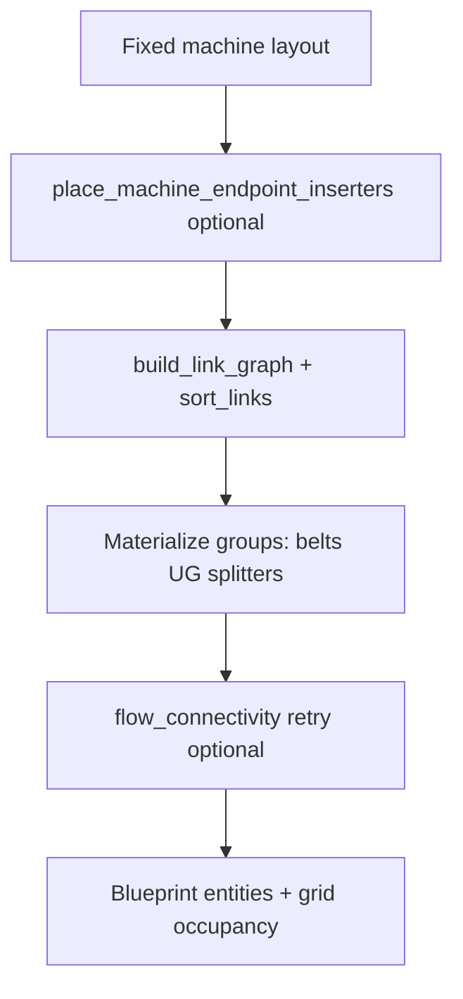

# Belt routing

How items move between machines, chests, and belts in generated blueprints. This is the reference for **`stage_connector.py`** (active routing) and how it shares logic with **Assisted Build**.

See also: [generation.md](generation.md) (pipeline overview), [placement-rules.md](placement-rules.md) (machine I/O geometry), [architecture.md](architecture.md) (module map).

---

## Overview

Belt routing happens **after** machine positions are fixed. The same entry point serves Autonomous Build and Assisted Build:

```
route_placed_layout(grid, entities, entity_number, stage_machines, nodes, …)
```

By default, `route_placed_layout` uses the **network router** (`planners/belt_network/`): it builds a **link graph** of item flows, orders links (base feeds → stages → outputs), materializes each **group** on a growing occupancy map (shared trunks, splitter fan-out), and optionally retries failed groups using `flow_connectivity`. Set `use_network_router=False` to use the legacy `connect_stages` / `connect_base_materials` / `connect_output_sinks` pipeline.



| Phase | Component | What it does |
|-------|-----------|----------------|
| 0 | `belt_network/link_graph.py` | `BeltLink` edges: source/sink knots, `group_key`, priority |
| 1 | `belt_network/router.py` | Order groups; trunk registry via `RoutingOccupancy` |
| 2 | `belt_network/pathfinder.py` | Belt-aware A* (reuse same-item belts; UG meta-edges) |
| 3 | `belt_network/materialize.py` | Splitter-before-belt placement per group |
| 4 | `core/flow_connectivity.py` | Validation-driven bounded retry |

Legacy pipeline (when `use_network_router=False`):

| Phase | Function | What it routes |
|-------|----------|----------------|
| 1 | `place_machine_endpoint_inserters` | Inserters at machine I/O knots |
| 2 | `connect_stages` | Crafted products between stages |
| 3 | `connect_base_materials` | Raw resources from input chests |
| 4 | `connect_output_sinks` | Products to output chests |

**Autonomous Build** calls `route_placed_layout(..., place_machine_knots=False)` with no `input_sources` / `output_sinks`. Inter-stage crafted links are routed; raw ore and output chests are **not** unless you add input/output cells (Assisted Build) or extend the planner.

**Assisted Build** rebuilds entities and calls `full_reroute()` → `route_placed_layout` with `input_sources` and `output_sinks` derived from placed chest cells. **Optimize** (toolbar or `U`) toggles continuous search via `start_optimization_search()` / `optimization_search_step()` (one trial per frame): fixed group orders for the first iterations, then random shuffles; keeps the best layout by `layout_score()` in `belt_network/optimize.py`. Stops when stale for N iterations or when max iterations is reached (Options). **Esc** or **Stop opt** ends early and applies the best variant found. `optimization_pass()` remains available for a single batch of up to four variants (tests / API).

| Priority | Rule |
|----------|------|
| 1 | **Viable** production flow (same checks as `layout_fitness` / `flow_connectivity`) |
| 2 | **Minimize** `transport-belt` count (largest weight) |
| 3 | **Splitters** when a link group has 2+ distinct sinks — bonus if a splitter is at the feed; penalty if missing |
| 4 | **Underground belts** — bonus for pairs whose span crosses a machine/obstacle tile; penalty for “waste” pairs (short span or clear ground) |

Splitters are not rewarded when no fan-out is required; extra splitters are mildly penalized.

---

## Key modules

| Module | Role in routing |
|--------|-----------------|
| `planners/belt_network/` | **Primary (default)** — link graph, occupancy, pathfinder, materialize, router |
| `planners/stage_connector.py` | Facade (`route_placed_layout`), belt/UG/splitter primitives, legacy `connect_*` |
| `planners/machine_io.py` | Lane anchors, inserter knots, local I/O blocks (Autonomous placement) |
| `planners/assisted_routing.py` | Builds `stage_machines` / `nodes`; `full_reroute` / incremental reroute |
| `core/pathfinding.py` | Generic A* (legacy fallback in `_route_belt_path`) |
| `core/flow_connectivity.py` | Post-routing validation; drives network router retry |
| `core/belt_router.py` | Legacy A* belt placer — **not** used by `route_placed_layout` |

---

## Lane anchors

Before any inter-stage belt is placed, each machine has **I/O lane geometry** from `machine_io.machine_io_lanes()`:

| Field | Meaning |
|-------|---------|
| `input_starts` | West/south/etc. end of each input belt row (one per recipe ingredient) |
| `input_connects` | Tile where an upstream belt should meet that input row |
| `output_start` / `output_end` | First / last tile of the output belt row |

Stages with multiple machines aggregate lanes via `stage_lanes_from_machines()` (first machine’s inputs, last machine’s output).

**Multi-ingredient recipes:** lane index comes from `ingredient_lane_index(recipe, ingredient)` so iron plate and copper plate inputs land on separate parallel rows (`INGREDIENT_LANE_SPACING = 2` tiles).

**Flow direction:** Autonomous rule-based placement can use N/E/S/W per stage. Inter-stage routing and Assisted Build currently assume **east flow** for knots and splitter placement (`FACTORIO_EAST`).

---

## Path building

### `_route_belt_path(start, end)`

1. Try **A\*** (`Pathfinder.shortest_path`) on the occupancy grid.
2. If no path, fall back to **L-shaped Manhattan** (`_manhattan_path`): horizontal first, then vertical.

### `place_belt_path(grid, entities, entity_number, path)`

Walks each tile in the path:

| Tile state | Action |
|------------|--------|
| Free | Place `transport-belt` with direction from `belt_direction_at_path_index` |
| Occupied by existing belt | Update belt direction only |
| Occupied by obstacle (straight run) | Try **underground-belt** input/output pair via `_try_underground_bridge` |
| Otherwise | Skip tile |

### Underground belts

`_place_underground_pair` enforces vanilla constraints:

- Input and output on a **straight line** matching belt direction
- Span between endpoints: 1 … `UNDERGROUND_BELT_MAX_UNDERGROUND_TILES` (4 for yellow underground)
- Only endpoint tiles occupy the grid; span tiles stay clear

Entity dict includes `"type": "input"` or `"type": "output"` on underground endpoints.

### Splitters

Used when **one producer output must reach two or more distinct consumer lanes**:

- `_needs_splitter_fanout(requests)` — false for a single consumer or duplicate targets
- Geometry is centralized in [`splitter_geometry.py`](../src/core/splitter_geometry.py):
  - **East/west:** footprint **2×1** (two parallel lanes on adjacent X tiles)
  - **North/south:** footprint **1×2** (two parallel lanes on adjacent Y tiles)
  - **One primary input belt** on the input face (e.g. west of anchor for east-facing)
  - **Two output belts** on the output face, offset **perpendicular** to flow (e.g. `(anchor_x+2, anchor_y±1)` for east) — not a straight line through `(anchor_x+2, anchor_y)`
- Splitter anchor = **top-left** footprint tile; placed at `(feed_x + 1, feed_y)` for east-flow feeds
- `_assign_splitter_branch_starts` maps north/south output lanes from `splitter_layout().output_belts`
- `_route_from_splitter_branches` Manhattan-routes each branch to its consumer
- `flow_connectivity` uses the same geometry so validation matches placed belts

If splitter placement fails (tiles occupied), routing **falls back** to direct `connect_lane_to_lane` per consumer (may overlap).

The same splitter fan-out pattern is used in `_connect_feed_fanout` when one **input chest** feeds multiple machine inputs.

---

## Stage-to-stage routing (`connect_stages`)

1. Build `stage_lanes` for every item in `stage_machines`.
2. For each consumer stage, for each crafted dependency `dep`:
   - Producer anchor: `output_start` (or `output_end`) of stage `dep`
   - Consumer anchor: `input_connects[lane_idx]` for ingredient `dep`
3. Group requests by **producer output tile** (`requests_by_producer`).
4. For each group:
   - **No fan-out:** `connect_lane_to_lane(producer_output, consumer_input, dest_knot=…)`
   - **Fan-out:** place splitter, route branches, merge any lane-offset tails

### `connect_lane_to_lane`

Core belt “rope” between two lane anchors:

```
producer_output ──[belts]──► consumer_input
         ▲                           ▲
   source_knot (optional)      dest_knot (optional inserter)
```

- Optionally places **inserter knots** at source/dest (`place_inserter_knot`)
- `dest_knot` routes to the inserter’s belt-side pickup tile (`knot_belt_tile`) when machine side belts are not pre-placed (Assisted Build)
- Path via `_route_belt_path` + `place_belt_path`
- Records a `connect` step when `placement_recorder` is set

---

## Base material routing (`connect_base_materials`)

Raw resources (`BASE_MATERIALS`) are **not** routed via the old horizontal top bus. Current behavior:

1. Collect every machine input that needs a base material.
2. Look up **`input_sources[resource]`** — list of `(chest_x, chest_y)` from user **Input Cells**.
3. Assign each consumer to the **nearest** input chest (Manhattan from `chest_belt_feed_start`).
4. For each chest, `_connect_feed_fanout`:
   - Place chest → belt inserter knot (`chest_to_belt_knot`)
   - Single consumer: direct `connect_lane_to_lane`
   - Multiple consumers: splitter at feed + branch routes (same as stage fan-out)

If no input cell exists for a resource, that resource is **skipped** (logged: *"No input cell for …"*).

Constants `BASE_BUS_Y`, `BASE_BUS_X_START`, `BASE_BUS_LENGTH` remain for **layout fitness estimates** only — not live routing.

---

## Output routing (`connect_output_sinks`)

Maps **`output_sinks[product]`** → list of output chest positions.

| Product key | Behavior |
|-------------|----------|
| Specific item (e.g. `inserter`) | Route from that stage’s producer output lanes |
| `"any"` (`OUTPUT_ANY_PRODUCT`) | Pick **terminal product** via `latest_chain_product()` (deepest end-of-chain item not consumed internally) |

Each route: producer output → `chest_belt_sink_connect` with `belt_to_chest_knot` on the chest.

---

## Local machine I/O (Autonomous placement)

During machine placement (before `route_placed_layout`), Autonomous Build may call `place_machine_io_block()`:

- 3 input belts + input inserter + machine + output inserter + 3 output belts
- Per-ingredient parallel input rows when `recipe_input_lane_count > 1`

Inter-stage routing then connects **between** stage lane anchors; it may reuse or extend existing belt tiles via `_update_belt_direction`.

Assisted Build **does not** place local I/O belts on machine drop — only machines and chests exist until `full_reroute()` runs.

---

## Inserter knots

An **inserter knot** is `(inserter_pos, drop_pos)` — where the inserter sits and where it drops/picks up.

| Helper | Use |
|--------|-----|
| `machine_input_inserter_knot` | Belt → machine (per ingredient lane) |
| `machine_output_inserter_knot` | Machine → belt |
| `chest_to_belt_knot` | Input chest → first belt tile |
| `belt_to_chest_knot` | Belt → output chest |
| `place_inserter_knot` | Writes inserter entity + direction |
| `place_machine_endpoint_inserters` | All machines, all lanes, before routing (when enabled) |

Inserter blueprint directions use Factorio 2.0 cardinals; display uses `inserter_direction_for_display()` in the UI.

---

## Flow validation

After routing, layout scoring can call `validate_blueprint_flow()` (`core/flow_connectivity.py`):

- Builds a directed graph: belts (flow direction), inserters (pickup → drop), underground pairs, splitters, machine interiors
- BFS checks that producer stages connect to consumers along valid item flow
- Errors become **viability blockers** in `layout_fitness` when entities are provided

---

## Assisted Build reroute cycle

```
User places machine / assigns recipe / moves input cell
        ↓
AssistedBuildState.full_reroute()
        ↓
_rebuild_machine_entities()  — clear belts/inserters, keep machines/chests
        ↓
rate_nodes_from_machines + stage_machines_from_placed
        ↓
route_placed_layout(input_sources, output_sinks)
```

Every recipe change or deletion triggers a full reroute so belt paths stay consistent with the current machine graph.

---

## Debugging belt issues

| Symptom | Likely cause | Where to look |
|---------|--------------|---------------|
| Crafted stages not linked | Missing stage in `stage_machines` or broken rate graph | `production_planner`, `connect_stages` logs |
| Raw ore not connected | No input cell for that resource | `connect_base_materials`, Assisted input cells |
| Gap in belt line | Obstacle with no valid underground span | `place_belt_path`, `_try_underground_bridge` |
| Wrong ingredient lane | Recipe ingredient order vs `ingredient_lane_index` | `machine_io`, `connect_stages` |
| Splitter missing | Fan-out needed but 2×1 tile blocked | `_place_splitter` fallback logs |
| Flow validation failure | Disconnected graph or wrong belt direction | `flow_connectivity.py` |

Enable INFO logging (set in `main.py` on Generate / Assisted / Replay):

```python
logging.basicConfig(level=logging.INFO, ...)
```

Use **Placement Replay** to step through `connect`, `splitter`, and `base_feed` recorder events.

### Headless routing smoke test

```python
import sys, json
from pathlib import Path
sys.path.insert(0, str(Path("src")))
from core.grid_env import Grid
from planners.production_planner import ProductionPlanner, RateNode
from planners.stage_connector import route_placed_layout
from core.constants import GenerationMode

with open("src/data/recipes.json") as f:
    recipes = json.load(f)

grid = Grid()
entities = []
# … build stage_machines + nodes …
entity_number, inputs = route_placed_layout(
    grid, entities, 1, stage_machines, nodes
)
print(len(entities), "entities after routing")
```

Relevant tests: `test_belt_paths`, `test_layout_routing`, `test_splitters_generation`, `test_underground_belts`, `test_flow_connectivity`, `test_assisted_routing`.

---

## Known limitations

| Area | Current behavior |
|------|------------------|
| Autonomous raw inputs | No automatic ore bus or chests — base feeds need Assisted input cells (or future planner work) |
| Splitter balancing | Fan-out only; not full throughput balancers for 3+ equal lanes |
| Belt tier | Yellow `transport-belt` / `underground-belt` / `splitter` only |
| Cardinal mix | Rule-based stages may use N/S/W flow; connectors and splitters assume east-facing trunk |
| `belt_router.py` | Legacy; do not wire for stage links without reconciling occupancy rules |
| Fluids / underground pipes | Not routed |

Extend **`stage_connector.py`** and **`machine_io.py`** for new routing behavior rather than duplicating paths in `machine_placer/` or `belt_router.py`.

---

## Quick reference: functions

| Function | File |
|----------|------|
| `route_placed_layout` | `stage_connector.py` |
| `connect_stages` | `stage_connector.py` |
| `connect_base_materials` | `stage_connector.py` |
| `connect_output_sinks` | `stage_connector.py` |
| `connect_lane_to_lane` | `stage_connector.py` |
| `place_belt_path` | `stage_connector.py` |
| `machine_io_lanes` | `machine_io.py` |
| `full_reroute` | `assisted_routing.py` |
| `validate_blueprint_flow` | `flow_connectivity.py` |
