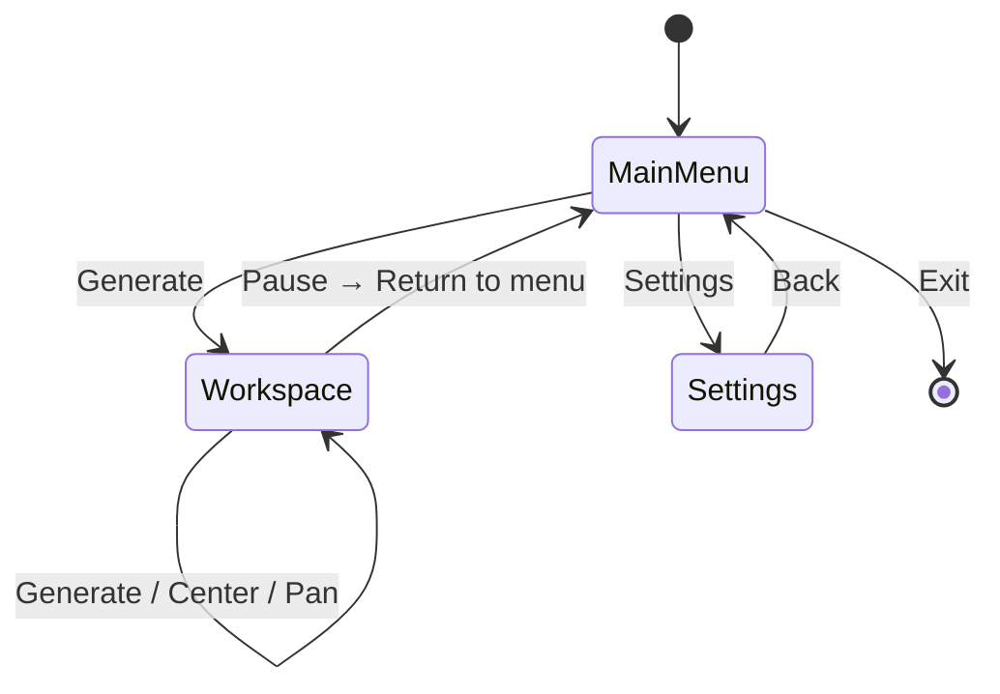

# Controls

How a user (or automated UI test) navigates the application.

## Application flow

1. **`python main.py`** → main menu.
2. **Generate** → blueprint workspace (may open targets modal first if configured).
3. **Set targets** → add items and rates → **Generate** in modal or toolbar.
4. **Copy BP** → clipboard string for Factorio.

## Main menu

| Input | Action |
|-------|--------|
| ↑ / ↓ or mouse | Navigate |
| Enter | Select |
| ESC | Exit application |

## Settings

- Set **Factorio installation path** (saved to `config.json`, gitignored).
- Required for sprite preview; generation still runs without it (entities render as placeholders if sprites missing).

## Blueprint workspace

### Toolbar

| Button | Action |
|--------|--------|
| **Set Targets** | Open modal: items, rates/min, Assemblers only / From raw |
| **Generate** | `run_generation_pipeline()` with current config |
| **Place: Rules / Genetic** | Toggle `PlacementStrategy` |
| **Center** | Pan camera so blueprint bounding box is centered above toolbar |
| **Copy BP** | Copy `blueprint_string` (needs `pyperclip`) |
| **Pause** | Overlay: Resume or Return to menu |

### Targets modal (`RecipePanel`)

| Action | How |
|--------|-----|
| Add target | Type item name (autocomplete), rate, Add |
| Remove | Per-row control in panel |
| Generate | Button in panel → runs pipeline and closes modal on success |
| Close | ESC or close action |

### Keyboard (workspace)

| Key | Action |
|-----|--------|
| `T` | Open targets modal |
| `G` | Generate (same as toolbar) |
| `C` | Center camera on blueprint |
| `R` | Reset camera to origin, zoom 1× |
| `S` | Screenshot (`blueprint_YYYYMMDD_HHMMSS.png` in cwd) |
| Mouse wheel | Zoom (0.1×–3×) |
| Left-drag | Pan |
| `ESC` | Close modal, or open/close pause |

### On-screen overlays

When entities exist and not paused:

- **Stage labels** — `S1: Iron Plate`, etc., from `production_stages`.
- **Top-left stats** — entity count, stages, zoom, placement mode, rate summary lines.
- **Green/red markers** — heuristic input/output hints (not exact belt endpoints).

### Pause menu

| Option | Effect |
|--------|--------|
| Resume | Continue workspace |
| Return to menu | `run_workspace()` returns `"menu"` |

## Defaults on first open

`main.py` passes `initial_targets=PRODUCTION_TARGETS` from `constants.py` and may open the targets modal immediately (`open_targets_modal=True`).
